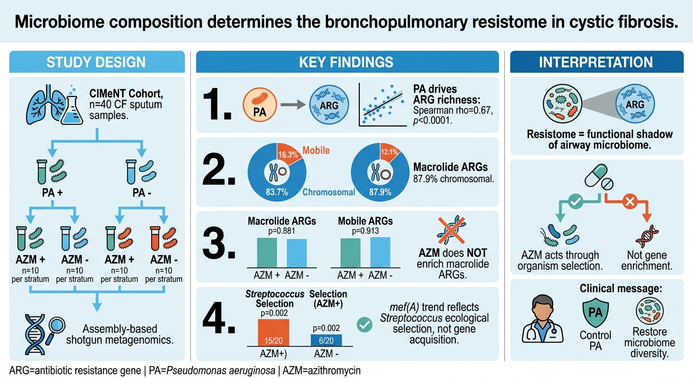
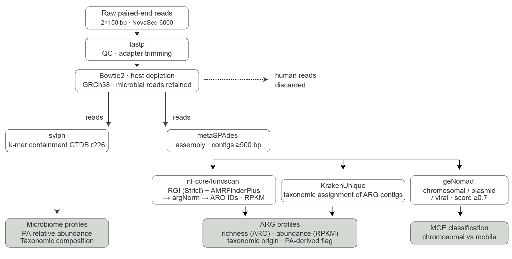

This repository contains the data and scripts necessary to reproduce all figures in the paper: *”Microbiome composition determines the bronchopulmonary resistome in cystic fibrosis.”*.  This is a metagenomics study of the bronchopulmonary antibiotic resistome in cystic fibrosis (CF). Shotgun metagenomic assemblies from 40 CF sputum samples were analysed using RGI (CARD) and AMRFinderPlus to characterise the resistome without mapping to a fixed reference. 
#### Key findings:

- *Pseudomonas aeruginosa* pulmotype is the primary driver of ARG richness in CF airways (Spearman ρ = 0.67, p < 0.0001).
- Macrolide ARGs are predominantly chromosomally encoded (87.9% of macrolide ARG contigs) and their abundance does not differ between AZM+ and AZM− patients.
- *mef*(A) abundance trend reflects *Streptococcus* ecological selection (15/20 vs 6/20, p=0.002) not gene acquisition
- CFTR modulator therapy (ivacaftor/lumacaftor+ivacaftor, n=21 vs n=19) is not associated with enrichment of mobile ARGs.

#### Schematic pipeline



---

## Repository structure

```
CIMENT_resistome/
├── README.md
├── LICENSE
├── environment.yml
├── scripts/
│   ├── fig_1.py                           ← Fig 1: full resistome overview
│   ├── fig_2.py                           ← Fig 2: PA pulmotype drives ARG richness
│   ├── fig_3.py                           ← Fig 3: macrolide ARG abundance by AZM status
│   ├── fig_4.py                           ← Fig 4: MGE context of CF ARGs
│   ├── fig_5.py                           ← Fig 5: CFTR modulators vs mobile ARGs
│   ├── build_merged_tables.py             ← upstream: build sample_metadata + arg_contigs
│   ├── compute_arg_rpkm.py                ← upstream: compute RPKM from summary tables
│   ├── summarize_idxstats.py              ← upstream: collapse raw idxstats → summary tables
│   └── build_genomad_master.py            ← upstream: parse geNomad plasmid summaries
├── data/
│   ├── README.md                          ← data dictionary
│   ├── sample_metadata.tsv                ← 40 rows × 29 cols: all per-sample metadata
│   ├── arg_contigs.tsv                    ← 791 rows × 16 cols: all ARG-carrying contigs
│   ├── merged_aro_per_sample.tsv          ← 1278 rows: ARO accessions per sample
│   ├── aro_prevalence.tsv                 ← 227 rows: prevalence per ARO
│   ├── resistome_class_per_sample.tsv     ← 40 rows: drug class pivot (Fig 1)
│   ├── assembly_arg_richness_taxonomy.tsv ← 40 rows: richness by organism (Fig 2)
│   └── macrolide_depth_hits.tsv           ← 100 rows: macrolide gene-to-contig
└── figures/
    ├── fig_1.pdf/.png                     ← Fig 1
    ├── fig_2.pdf/.png                     ← Fig 2
    ├── fig_3.pdf/.png                     ← Fig 3
    ├── fig_4.pdf/.png                     ← Fig 4
    └── fig_5.pdf/.png                     ← Fig 5
```

---

## Data availability

| Dataset | Location |
|---------|----------|
| Raw metagenomic reads | ENA: [PRJEB111121](https://www.ebi.ac.uk/ena/browser/view/PRJEB111121) |
| Processed summary tables | `data/` directory (this repo) |
| Large intermediate files (hAMRonization report 338 MB; depth table 59 MB) | Zenodo DOI: [pending] |

---

## Requirements

- Python ≥ 3.10
- Conda/mamba (recommended)

```bash
conda env create -f environment.yml
conda activate ciment_resistome
```

Key packages: `pandas`, `numpy`, `matplotlib`, `scipy`.

---

## How to reproduce figures

All scripts read from `data/` and write to `figures/`. Paths are resolved relative to each script's location — run from any directory.

| Script | Output |
|--------|--------|
| `python scripts/fig_1.py` | `figures/fig_1.pdf` |
| `python scripts/fig_2.py` | `figures/fig_2.pdf` |
| `python scripts/fig_3.py` | `figures/fig_3.pdf` |
| `python scripts/fig_4.py` | `figures/fig_4.pdf` |
| `python scripts/fig_5.py` | `figures/fig_5.pdf` |

The processed outputs of the upstream pipeline are already included in `data/`, so re-running the upstream steps is not required to reproduce the figures. They are provided for full transparency:

```bash
# 1. Collapse raw idxstats → compact tables (requires data/mapping_idxstats/)
python scripts/summarize_idxstats.py

# 2. Compute per-contig RPKM and parse geNomad plasmid summaries
python scripts/compute_arg_rpkm.py
python scripts/build_genomad_master.py

# 3. Rebuild master tables from updated outputs
python scripts/build_merged_tables.py
```

---

## License

MIT — see [LICENSE](LICENSE).
